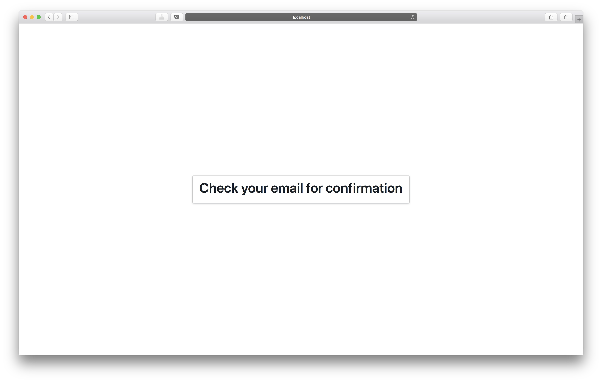
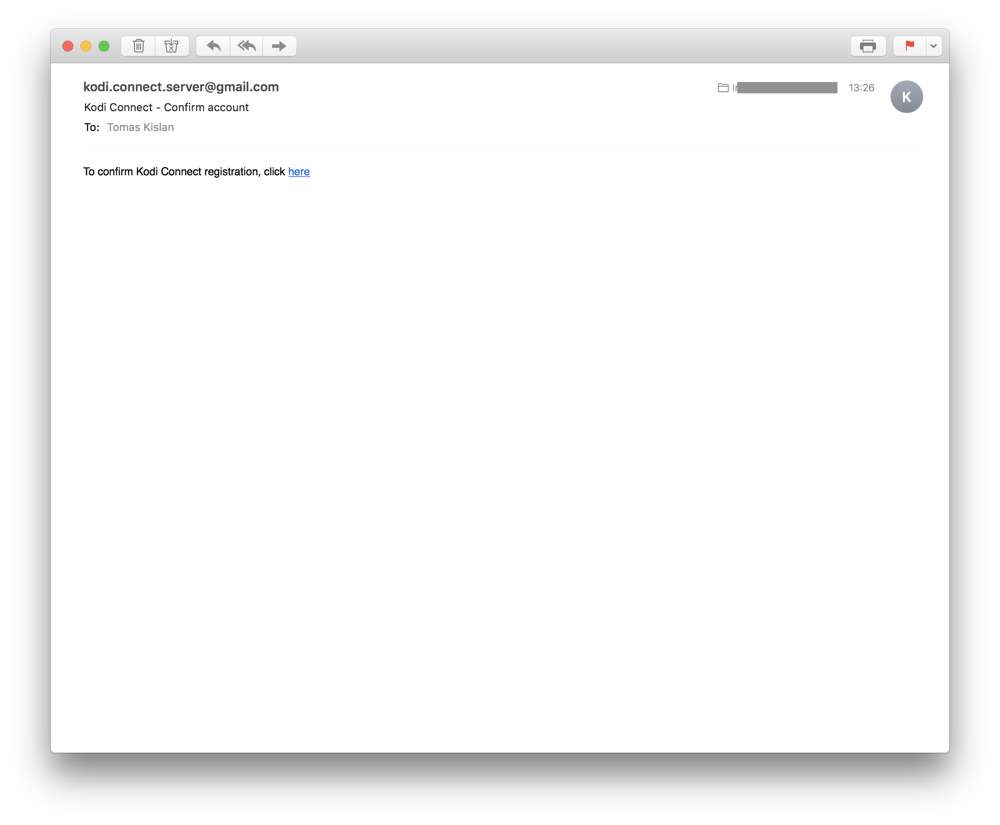
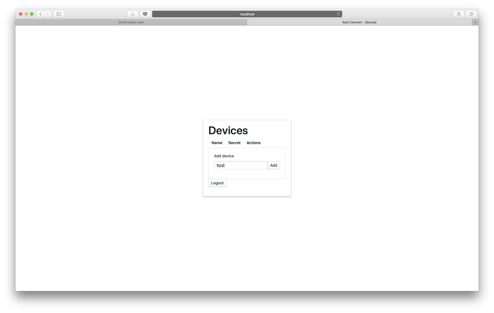
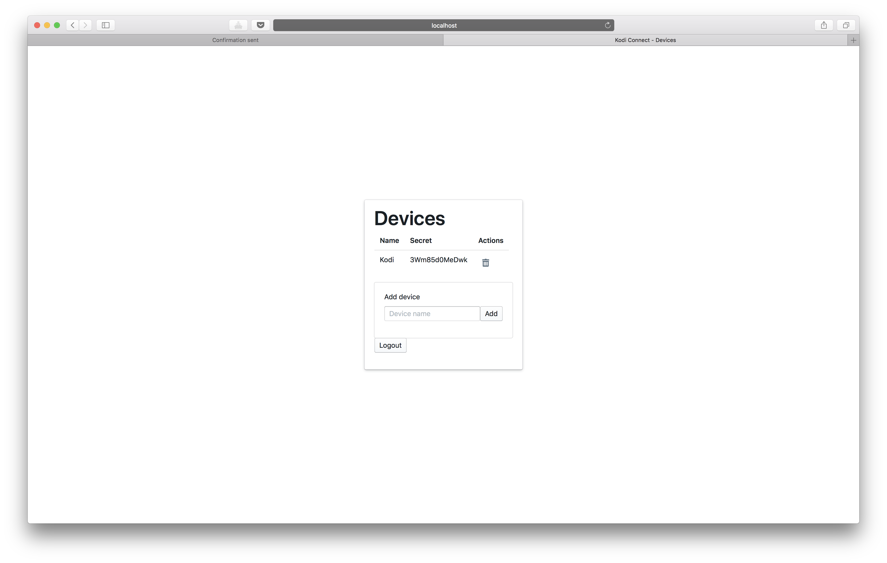

## Registration steps

Navigate to [https://kodiconnect.kislan.sk](https://kodiconnect.kislan.sk)

Click **Register** to move to registration page.

Enter your valid email address, and choose a password (currently it's not possible to reset/change password).

You will also have to enter this password when linking Alexa Skill, and/or Google Assistant "Skill".

Confirmation page will look like this, and you can close this window.

After receiving and open the confirmation email, click on the link, which will open the confirmation page.

Here just click on the link, which will take you to the Login page.

Enter email address and password which you entered on the registration page.

Choose a name for your Kodi instance. You can just enter **Kodi**, as this is unique to your account.

This is only relevant if you plan to use multiple Kodi instances.

A secret will be generated for your Kodi instance, which will be required for [Kodi Connect Addon](https://github.com/kodi-connect/kodi-connect-addon)

